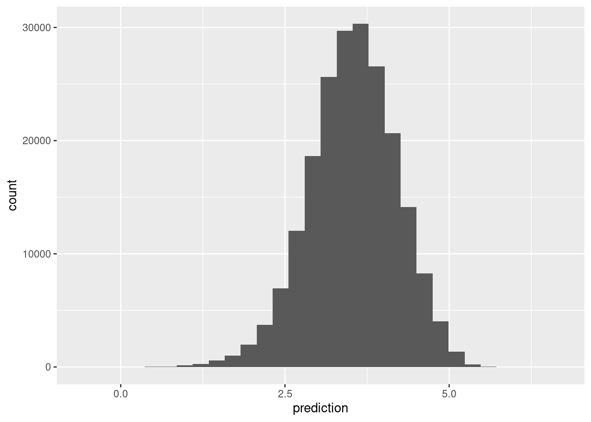

# Dimensiones latentes para recomendación

En las similitudes que vimos arriba, es razonable pensar que hay ciertos "conceptos" 
que agrupan o separan películas, y así mismo, que los usuarios se distinguen por el gusto o no
que tienen por estos "conceptos".

En esta parte, consideramos la idea de utilizar reducción de dimensionalidad para
hacer recomendaciones. Esta idea propone que hay ciertos factores latentes (no observados)
que describen películas con "contenido implícito similar", y usuarios según su interés en esa dimensión.

Otra manera de llamar estos factores latentes es **embedding**: buscamos un **embedding** (una 
representación numérica en cierta dimensión no muy alta) que nos permita predecir el gusto
de un usuario por una película.

Este método nos permitirá también controlar mejor los resultados ruidosos que
obtuvimos en los ejemplos anteriores (usando regularización y reducción
de dimensión).


### Ejemplo: una dimensión latente{#ejemplo}
Por ejemplo: consideramos una dimensión de películas serias contra películas divertidas.
$3$ películas podrían describirse con

$$v=(-2,0,1)$$,

lo que interpretamos como la película $1$ es divertida (negativa en seriedad-diversión), la película $2$ está en promedio, y la película $3$ es más seria que las dos anteriores.
 
Por otro lado, tenemos descriptores de 5 usuarios:

$$u=(2,3,-3,0,1)$$
que dice que a los primeros dos usuarios les gustan las películas serias, al tercero le gustan las divertidas, y los dos últimos no tienen preferencia clara a lo largo de esta dimensión.

Qusiéramos predecir el gusto usando estos dos vectores. Nuestras predicciones (considerando que $u$ y $v$ son matrices de una columna) serían simplemente

$$\widetilde{X} = u v^t$$


```r
u <- c(2,3,-3,0,1)
v <- c(-2,0,1)
gustos <- u %*% t(v)
gustos
```

```
##      [,1] [,2] [,3]
## [1,]   -4    0    2
## [2,]   -6    0    3
## [3,]    6    0   -3
## [4,]    0    0    0
## [5,]   -2    0    1
```


Así que al usuario $1$ le recomndamos la película $3$, pero al usuario $3$ le recomendamos la película $1$.

---

La idea es entonces encontrar pesos para películas $u$ y para usuarios $v$ de forma que
$X\approx \widetilde{X} = uv^t$: podemos reproducir las calificaciones observadas a partir de nuestro modelo de factores latentes.

Nótese sin embargo que hay varias dimensiones que pueden describir a películas y usuarios:
por ejemplo, seria-divertida, artística-hollywood, ciencia ficción, con/sin violencia, etc. 
Podemos proponer más dimensiones latentes de la siguiente forma:


### Ejemplo: dos dimensiones latentes {#ejemplo}
Tenemos la dimensión anterior de seria-divertida

```r
v_1 <- c(-2,0,1)
u_1 <- c(2,3,-3,0,1)
```
Y supongamos que tenemos otra dimensión con violencia - sin violencia

```r
v_2 <- c(-3,2,2)
u_2 <- c(-3,-3,0,-2,4)
```


Que quiere decir que las películas $2, 3$ tienen volencia, pero la película $1$ no. Por otra parte, a los usuarios $1,2$ y $5$ no les gustan las películas con violencia, mientras que al usuario $5$ si les gustan.

La idea ahora es que el gusto de una persona por una película se escribe como combinación de las dos dimensiones. Por ejemplo, para la persona $1$ tenemos, y la película $1$, empezamos haciendo


```r
u_1[1]*v_1[1]
```

```
## [1] -4
```

```r
u_2[1]*v_2[1]
```

```
## [1] 9
```

lo que quiere decir que el hecho de que la película $1$ no sea seria le resta $4$ en gusto (pues la película $1$ está del lado "divertido"), pero le suma $9$ en gusto, pues es una película sin violencia y esta persona está del lado "sin violencia".

Sumamos para encontrar el gusto total


```r
u_1[1]*v_1[1] + u_2[1]*v_2[1]
```

```
## [1] 5
```

Para calcular los gustos sobre todas las personas y películas, haríamos


```r
U <- cbind(u_1, u_2)
V <- cbind(v_1, v_2)
U
```

```
##      u_1 u_2
## [1,]   2  -3
## [2,]   3  -3
## [3,]  -3   0
## [4,]   0  -2
## [5,]   1   4
```

```r
V
```

```
##      v_1 v_2
## [1,]  -2  -3
## [2,]   0   2
## [3,]   1   2
```

```r
U %*% t(V)
```

```
##      [,1] [,2] [,3]
## [1,]    5   -6   -4
## [2,]    3   -6   -3
## [3,]    6    0   -3
## [4,]    6   -4   -4
## [5,]  -14    8    9
```

- El renglón $j$ de $U$ son los valores en las dimensiones latentes para
la película $i$ (descriptores de usuarios).
- El renglón $j$ de $V$ son los valores en las dimensiones latentes para
el usuario $j$ (descriptores de películas)


\BeginKnitrBlock{resumen}<div class="resumen">Con $k$ dimensiones latentes, el modelo que proponemos es:

$$\widetilde{X} = UV^t$$

donde $U$ es una matrix de $n\times k$ ($n=$ número de usuarios), y $V$ es una matriz
de $p \times k$, donde $p$ es el número de películas.

Buscamos que, si $X$ son las verdaderas calificaciones, entonces
$$X\approx \widetilde{X}.$$

y nótese que esta aproximación es en el sentido de las entradas de $X$ que **son observadas**. Sin embargo, $\widetilde{X}$ nos da predicciones para **todos los pares película-persona**.</div>\EndKnitrBlock{resumen}


Bajo este modelo, la predicción para el usuario $i$ y la película $j$
es la siguiente suma sobre las dimensiones latentes:

$$\widetilde{x}_{ij} =\sum_k u_{ik} v_{jk}$$

que expresa el hecho de que el gusto de $i$ por $j$ depende de una combinación (suma)
de factores latentes de películas ponderados por gusto por esos factores del usuario.


El número de factores latentes $k$ debe ser seleccionado (por ejemplo, según el error de validación). Dado $k$, para encontrar $U$ y $V$ (un total de $k(n+p)$ parámetros) buscamos
minimizar 

$$\sum_{(i,j)\, obs} (x_{ij}-\widetilde{x}_{ij})^2,$$


que también podemos escribir este problema (recuérdese que $u_i$ y
$v_j$ aquí son vectores renglón) como

$$\min_{U,V}\sum_{(i,j)\, obs} (x_{ij}-u_iv_j^t)^2$$
donde $u_i$ es el renglón $i$-esimo de $U$ (gustos latentes del usuario $i$ en cada dimensión), y $v_j$ es el renglón $j$-ésimo de la matriz $V$ (calificación latente de la película en cada dimensión)


\BeginKnitrBlock{resumen}<div class="resumen">**¿Por qué funciona la idea de factores latentes?**

- El método de factorización de matrices de grado bajo ($k$)
funciona compartiendo información a lo largo de películas y usuarios. Como tenemos
que ajustar los datos observados, y solo tenemos a nuestra disposición $k$
  descriptores para cada película y usuario, una minimización exitosa
captura regularidades en los datos.

- Es importante que la representación sea de grado relativamente bajo,
pues esta "compresión" es la que permite que las dimensiones 
latentes capturen regularidades que están en los datos observados (que
esperamos encontrar en el proceso de ajuste). 

- Al reducir la dimensión, también funcionan mejor métricas relativamente
simples para calcular similitud entre usuarios o películas.</div>\EndKnitrBlock{resumen}


Por ejemplo, supongamos que el gusto por las películas sólo depende de
una dimensión sería - divertida. Si ajustamos un modelo de un solo
factor latente, un **mínimo** se alcanzaría separando con la dimensión latente
las películas serias de las divertidas, y los usuarios que prefieren películas
serias o divertidas. Esta sería una buena explicación de los datos observados,
y las predicciones para películas no vistas sería buena usando simplemente
el valor en seriedad de la película (extraída de otras personas con gustos
divertido o serio) y el gusto por seriedad de esa persona (extraida de la 
observación de que le gustan otras películas serias u otras divertidas).

### Combinación con modelo base

Podemos usar también ideas de nuestro modelo base y modelar desviaciones en lugar de calificaciones directamente:

Si $X^0$ son las predicciones del modelo de referencia, y
$$R = X-X^0$$
son los residuales del modelo base, buscamos mejor
$$R\approx \widetilde{X} = UV^t$$
de manera que las predicciones finales son
$$X^0 + \widetilde{X}$$

Veremos también más adelante cómo regularizar estos sesgos como
parte de la construcción del modelo.

## Factorización de matrices

Como vimos arriba, reexpresamos nuestro problema como un problema
de factorización de matrices  (encontrar $U$ y $V$). Hay varias alternativas populares para atacarlo:

- Descomposición en valores singulares (SVD).
- Mínimos cuadrados alternados.
- Descenso en gradiente estocástico.

No vamos a ver más de este enfoque de SVD que discutimos anteriormente, pues no
es del todo apropiado: nuestras matrices tienen muchos datos faltantes, y SVD  no está diseñado para lidiar con este problema. Se pueden hacer ciertas imputaciones (por ejemplo, insertar 0's una vez que centramos por usuario), pero los siguientes dos métodos están mejor adaptados para
nuestro problema.

## Mínimos cuadrados alternados

Supongamos entonces que queremos encontrar matrices $U$ y $V$, donde $U$ es una matrix de $n \times k$ ($n=$ número de usuarios), y $V$ es una matriz
de $p \times k$, donde $p$ es el número de películas que nos de una
aproximación de la matrix $X$ de calificaciones
$$
X \approx UV^t
$$
Ahora supongamos que conocemos $V_1$. Si este es el caso, entonces queremos
resolver para $U_1$:
$$ \min_{U_1}|| X - U_1V_1^t||_{obs}^2$$
Como $V_1^t$ están fijas, este es un problema de mínimos cuadrados usual, y puede resolverse analíticamente (o usar descenso en gradiente, que
es simple de calcular de forma analítica) para encontrar $U_1$. Una vez que encontramos $U_1$, la fijamos, e intentamos ahora resolver para $V$:

$$ \min_{V_2}|| X - U_1V_2^t||_{obs}^2$$
Y una vez que encontramos $V_2$ resolvemos

$$ \min_{U_2}|| X - U_2V_2^t||_{obs}^2$$

Continuamos este proceso hasta encontrar un mínimo local o hasta cierto número de iteraciones. Para inicializar $V_1$, en [@alsreg] se recomienda tomar como primer
renglón el promedio de las calificaciones de las películas, y el resto 
números aleatorios chicos (por ejemplo $U(0,1)$). También pueden inicializarse con números
aleatorios chicos las dos matrices.

### Mínimos cuadrados alternados con regularización

Para agregar regularización y lidiar con los datos ralos, podemos
incluir un coeficiente adicional. Minimizamos entonces (como en
 [@alsreg]):

$$\min_{U,V}\sum_{(i,j)\, obs} (x_{ij}-u_i^tv_j)^2 + 
\lambda \left ( \sum_i n_{i}||u_i||^2 + \sum_j m_{j} ||v_j||^2 \right)$$

y modificamos de manera correspondiente cada paso de mínimos cuadrados
mostrado arriba. $n_{i}$ es el número de evaluaciones del usuario $i$, y
$m_j$ es el número de evaluaciones de la película $j$.

**Observaciones**:

- Nótese que penalizamos el tamaños de los vectores $u_i$ y $v_j$ para evitar sobreajuste (como en regresión ridge).
- Nótese también que los pesos $n_i$ y $m_j$ en esta regularización hace comparables el término que aparece en la suma de los residuales al cuadrado
(la primera suma),
y el término de regularización: por ejemplo, si el usuario $i$ hizo
$n_i$ evaluaciones, entonces habrá $n_i$ términos en la suma de la izquierda. Lo mismo podemos decir acerca de las películas.
- Este no es el único término de regularización posible. Por ejemplo, podríamos *no* usar los pesos $n_i$ y $m_j$, y obtendríamos
un esquema razonable también, donde hay más regularización relativa
para usuarios/películas que tengan pocas evaluaciones.

Este método está implementado en [spark](https://spark.apache.org/docs/3.0.0/mllib-collaborative-filtering.html). La implementación está basada parcialmente en [@alsreg]. La inicialización
es diferente en spark, ver [el código](https://github.com/apache/spark/blob/v3.0.0/mllib/src/main/scala/org/apache/spark/ml/recommendation/ALS.scala), donde cada renglón se inicializa con
un vector de $N(0,1)$ normalizado.

En este caso, copiamos nuestra tabla a spark (nota: esto es algo que normalmente no haríamos, los datos habrían sido cargados en el cluster
de spark de otra forma):


```r
library(tidyverse)
library(sparklyr)
# configuración para spark
spark_install(version = "3.1.2")
config <- spark_config()
config$`spark.env.SPARK_LOCAL_IP.local` <- "0.0.0.0"
config$`sparklyr.shell.driver-memory` <- "8G"
config$spark.executor.memory <- "2G"
```


```r
# conectar con "cluster" local
sc <- spark_connect(master = "local", config = config)
```


```r
spark_set_checkpoint_dir(sc, './checkpoint')
```


```r
dat_tbl <- spark_read_csv(sc, name="netflix", "../datos/netflix/dat_muestra_nflix.csv") 
dat_tbl <- dat_tbl |> select(-fecha)
```


```r
usuario_val <- dat_tbl |> select(usuario_id) |> 
  sdf_distinct() |> 
  sdf_sample(fraction = 0.1) |> 
  compute("usuario_val")
pelicula_val <- dat_tbl |> select(peli_id) |>
  sdf_distinct() |> 
  sdf_sample(fraction = 0.1) |> 
  compute("pelicula_val")
valida_tbl <- dat_tbl |> 
  inner_join(usuario_val) |> 
  inner_join(pelicula_val) |> 
  compute("valida_tbl")
```

```
## Joining, by = "usuario_id"
```

```
## Joining, by = "peli_id"
```


```r
entrena_tbl <- dat_tbl |> anti_join(valida_tbl) |> 
  compute("entrena_tbl")
```

```
## Joining, by = c("peli_id", "usuario_id_orig", "calif", "usuario_id")
```

```r
entrena_tbl |> tally()
```

```
## # Source: spark<?> [?? x 1]
##          n
##      <dbl>
## 1 20782354
```

```r
valida_tbl |> tally()
```

```
## # Source: spark<?> [?? x 1]
##        n
##    <dbl>
## 1 203630
```

Vamos a hacer primero una descomposición en $15$ factores,
con regularización relativamente alta:


```r
modelo <- ml_als(entrena_tbl, 
              rating_col = 'calif',
              user_col = 'usuario_id',
              item_col = 'peli_id', 
              rank = 15, reg_param = 0.05,
              checkpoint_interval = 4,
              max_iter = 50)
# Nota: checkpoint evita que la gráfica de cálculo
# sea demasiado grande. Cada 4 iteraciones hace una
# nueva gráfica con los resultados de la última iteración.
```


```r
modelo
```

```
## ALSModel (Transformer)
## <als__0286ac8c_c5e0_401f_b8cd_8e23b6c4f181> 
##  (Parameters -- Column Names)
##   cold_start_strategy: nan
##   item_col: peli_id
##   prediction_col: prediction
##   user_col: usuario_id
##  (Transformer Info)
##   item_factors: <tbl_spark> 
##   rank:  int 15 
##   recommend_for_all_items: <function> 
##   recommend_for_all_users: <function> 
##   user_factors: <tbl_spark>
```

Hacemos predicciones para el conjunto de validación:


```r
preds <- ml_predict(modelo, valida_tbl) |>
  mutate(prediction = ifelse(isnan(prediction), 3.5, prediction))
ml_regression_evaluator(preds, label_col = "calif", prediction_col = "prediction",
  metric_name = "rmse")
```

```
## [1] 0.8297596
```

Y podemos traer a R los datos de validación (que son chicos) para examinar:


```r
preds_df <- preds |> collect() #traemos a R con collect
ggplot(preds_df, aes(x = prediction)) + geom_histogram()
```

```
## `stat_bin()` using `bins = 30`. Pick better value with `binwidth`.
```




Y redujimos considerablemente el error del modelo base. Examinamos 
ahora las dimensiones asociadas con películas:


```r
modelo$item_factors 
```

```
## # Source: spark<?> [?? x 3]
##       id features   features_1
##    <int> <list>          <dbl>
##  1    10 <dbl [15]>     -0.613
##  2    20 <dbl [15]>     -0.487
##  3    30 <dbl [15]>     -0.788
##  4    40 <dbl [15]>     -0.738
##  5    50 <dbl [15]>     -0.744
##  6    60 <dbl [15]>     -0.281
##  7    70 <dbl [15]>     -0.519
##  8    80 <dbl [15]>     -0.889
##  9    90 <dbl [15]>     -0.578
## 10   100 <dbl [15]>     -0.753
## # … with more rows
```


```r
V_df <- modelo$item_factors |>
  select(id, features) |> collect() |> 
  unnest_wider(features, names_sep = "_")
```

Nota: La columna *features* contiene la misma información de *feature_1,feature_2,...*, pero en forma de lista.

Examinemos la interpretación de los factores latentes de las
películas. 


```r
pelis_nombres <- read_csv('../datos/netflix/movies_title_fix.csv', col_names = FALSE, na = c("", "NA", "NULL"))
```

```
## Rows: 17770 Columns: 3
```

```
## ── Column specification ────────────────────────────────────────────────────────
## Delimiter: ","
## chr (1): X3
## dbl (2): X1, X2
```

```
## 
## ℹ Use `spec()` to retrieve the full column specification for this data.
## ℹ Specify the column types or set `show_col_types = FALSE` to quiet this message.
```

```r
names(pelis_nombres) <- c('peli_id','año','nombre')
medias_peliculas <- entrena_tbl |> group_by(peli_id) |> 
  summarise(num_calif_peli = n(), media_peli = mean(calif)) |> 
  collect()
```

```
## Warning: Missing values are always removed in SQL.
## Use `mean(x, na.rm = TRUE)` to silence this warning
## This warning is displayed only once per session.
```

```r
latentes_pelis <- V_df |> 
  rename(peli_id = id) |> 
  left_join(pelis_nombres |> left_join(medias_peliculas))
```

```
## Joining, by = "peli_id"
```

```
## Joining, by = "peli_id"
```

```r
latentes_pelis <- latentes_pelis |> 
    mutate(num_grupo = ntile(num_calif_peli, 10))
```

Podemos examinar las dimensiones latentes:


```r
top_tail <- function(latentes_pelis, feature){
top_df <- arrange(latentes_pelis, {{ feature }} ) |> 
  select(nombre, {{ feature }}, media_peli, num_calif_peli) |> 
  filter(num_calif_peli > 2000) |> 
  head(100) 
tail_df <- arrange(latentes_pelis, desc({{ feature }}) ) |> 
  select(nombre, {{ feature }}, media_peli, num_calif_peli) |> 
  filter(num_calif_peli > 2000) |> 
  head(100)
print(top_df)
print(tail_df)
bind_rows(top_df, tail_df)
}
res <- top_tail(latentes_pelis, features_3)
```

```
## # A tibble: 100 × 4
##    nombre                        features_3 media_peli num_calif_peli
##    <chr>                              <dbl>      <dbl>          <dbl>
##  1 The Best of Friends: Vol. 2       -0.938       4.11           2713
##  2 Friends: The Series Finale        -0.901       4.12           3809
##  3 Friends: Season 3                 -0.880       4.08           4844
##  4 The Best of Friends: Vol. 1       -0.875       4.04           4999
##  5 The Best of Friends: Season 3     -0.869       4.17           4325
##  6 The Best of Friends: Season 4     -0.861       4.26           3792
##  7 Friends: Season 4                 -0.860       4.15           4853
##  8 Friends: Season 1                 -0.853       4.11           5050
##  9 Friends: Season 5                 -0.852       4.23           4386
## 10 Friends: Season 6                 -0.846       4.28           3975
## # … with 90 more rows
## # A tibble: 100 × 4
##    nombre                    features_3 media_peli num_calif_peli
##    <chr>                          <dbl>      <dbl>          <dbl>
##  1 Brazil                          1.27       3.81           4557
##  2 Hellraiser                      1.14       3.39           3582
##  3 Evil Dead 2: Dead by Dawn       1.13       3.72           4148
##  4 Dawn of the Dead                1.13       3.59           3432
##  5 Night of the Living Dead        1.11       3.55           4722
##  6 Dead Man                        1.10       3.63           2345
##  7 Repo Man                        1.08       3.47           2662
##  8 The Evil Dead                   1.07       3.76           4240
##  9 A Clockwork Orange              1.05       3.72          15551
## 10 Blade Runner                    1.04       3.96          13298
## # … with 90 more rows
```

Otra dimensión latente:


```r
res <- top_tail(latentes_pelis, features_4)
```

```
## # A tibble: 100 × 4
##    nombre                                 features_4 media_peli num_calif_peli
##    <chr>                                       <dbl>      <dbl>          <dbl>
##  1 But I'm a Cheerleader                      -0.653       3.38           3087
##  2 The Craft                                  -0.596       3.43           4000
##  3 Hocus Pocus                                -0.590       3.33           4131
##  4 Bio-Dome                                   -0.587       2.80           2249
##  5 Now and Then                               -0.560       3.60           2712
##  6 The Sweetest Thing                         -0.554       3.16           3377
##  7 Romy and Michele's High School Reunion     -0.546       3.18           3696
##  8 Don't Tell Mom the Babysitter's Dead       -0.540       3.18           3585
##  9 Practical Magic                            -0.538       3.57           6847
## 10 Encino Man                                 -0.538       3.11           4148
## # … with 90 more rows
## # A tibble: 100 × 4
##    nombre                           features_4 media_peli num_calif_peli
##    <chr>                                 <dbl>      <dbl>          <dbl>
##  1 Patton                                 1.18       3.99           7820
##  2 Lawrence of Arabia                     1.12       4.13           8092
##  3 The Bridge on the River Kwai           1.08       4.13           7372
##  4 The Longest Day                        1.07       4.03           2403
##  5 Ben-Hur: Collector's Edition           1.06       3.97           5490
##  6 Citizen Kane                           1.04       4.03          12924
##  7 The Godfather                          1.04       4.50          20114
##  8 High Noon                              1.03       3.91           4473
##  9 The Treasure of the Sierra Madre       1.03       4.01           2903
## 10 The Godfather Part II                  1.02       4.40          14953
## # … with 90 more rows
```

**Nota**: Podemos usar **ml_recommend** para producir recomendaciones de películas para
usuarios, o para cada película los usuarios más afines.


```r
#top_recom <- ml_recommend(modelo, type = "items", n = 1) 
```


```r
sparklyr::spark_disconnect_all()
```

```
## [1] 1
```

### Ejercicio {-}
Examina otras dimensiones latentes, ¿qué puedes interpretar?

## Retroalimentación implícita

Esta sección está basada en [@recomendacion-implicita].

En el ejemplo que vimos arriba, la retroalimentación es expícita en el 
sentido de que los usuarios califican los artículos ($1-$ no me gustó nada,
hasta $5-$ me gustó mucho). Sin embargo, es común encontrar casos
donde no existe esta retroalimentación explícita, y solo tenemos medidas
del gusto implícito, por ejemplo:

- Cuántas veces un usuario ha pedido un cierto artículo.
- Qué porcentaje del programa fue visto.
- Cuánto tiempo pasó en la página web.
- Cuántas veces oyó una canción.

Estos datos tienen la ventaja de que describen acciones del usuario,
en lugar de un rating que puede estar influido por sesgos de imagen
o de la calificación que "debería" tener un artículo además 
de la preferencia: quizá
disfruto muchísimo *Buffy the Vampire Slayer*, pero lo califico con un $3$,
aunque un documental de ballenas que simplemente me gustó le pongo un $5$.
En los datos implícitos se vería de todas formas mi consumo frecuente
de *Buffy the Vampire Slayer*, y quizá unos cuantos de documentales 
famosos.

Sea $r_{ij}$ una medida implícita como las mencionadas arriba, para el usuario
$i$ y el artículo $j$. Ponemos $r_{i,j}=0$ cuando no se ha observado interacción
entre este usuario y el artículo. 

Una diferencia importante con los ratings explícitos es que los datos
implícitos son en un sentido menos informativos que los explícitos:

- Puede ser que el valor de $r_{ij}$ sea relativamente bajo (pocas interacciones), pero de todas formas se trate de un artículo que es muy preferido (por ejemplo, solo vi Star Wars I una vez, pero me gusta mucho, o nunca he encontrado Star Wars I en el catálogo). Esto no pasa con los ratings, pues ratings bajos indican baja preferencia.

- Sin embargo, estamos seguros de que niveles altos de interacción (oyó muchas veces una canción, etc.), es indicación de preferencia alta.

- Usualmente la medida $r_{ij}$ **no** tiene faltantes, o tiene un valor implícito para faltantes. Por ejemplo, si la medida es % de la película que vi, todas las películas con las que no he interactuado tienen $r_{ij}=0$.

Así que en nuestro modelo no necesariamente queremos predecir directamente la variable $r_{ij}$: puede haber artículos con predicción baja de $r_{ij}$ que
descubramos de todas formas van a ser altamente preferidos. Un modelo que haga
una predicción de $r_{îj}$ reflejaría más los patrones de consumo actual en lugar
de permitirnos descubrir artículos preferidos con los que no necesariamente existe interacción.

### Ejemplo

Consideremos los siguientes usuarios, donde medimos por ejemplo el número de minutos
que pasó cada usuario viendo cada película:


```r
imp <- tibble(usuario = 1:6,
              StarWars1 = c(0, 0, 0, 150, 300, 250),
              StarWars2 = c(250,  200, 0, 200, 220,180), 
              StarWars3 = c(0, 250, 300, 0, 0, 0),
              Psycho = c(5, 1, 0, 0, 0, 2)) 
imp
```

```
## # A tibble: 6 × 5
##   usuario StarWars1 StarWars2 StarWars3 Psycho
##     <int>     <dbl>     <dbl>     <dbl>  <dbl>
## 1       1         0       250         0      5
## 2       2         0       200       250      1
## 3       3         0         0       300      0
## 4       4       150       200         0      0
## 5       5       300       220         0      0
## 6       6       250       180         0      2
```


Quiséramos encontrar una manera de considerar los 0's como información más suave (es decir, alguien puede tener valores bajos de interacción con una película, pero esto no implica necesariamente que no sea preferida). Esto implica que es más importante ajustar
los valores altos del indicador implícito de preferencia.

---

Una solución propuesta en [@recomendacion-implicita] (e implementada en 
spark) es darle menos importancia al valor $r_{ij}$ en la construcción
de los factores latentes, especialmente si tiene valores bajos. 

Para hacer esto, primero definimos la variable de preferencia

$$p_{ij} = 
\begin{cases}
1, &\mbox{si } r_{ij}>0,\\ 
0, &\mbox{si } r_{ij}=0.\\
\end{cases}$$

Esta variable $p_{ij}$, cuando vale uno, indica algún nivel de confianza en la preferencia.
¿Pero qué tanto valor debemos darle a esta preferencia? Definimos la confianza
como
$$c_{ij} = 1+ \alpha r_{ui},$$
donde $\alpha$ es un parámetro que hay que afinar (por ejemplo $\alpha$ entre $1$ y $50$). Para predicciones de vistas de TV, en [@recomendacion-implicita] utilizan
$\alpha = 40$, donde $r_{ij}$ es el número de veces que el usuario ha visto
un programa (contando vistas parciales, así que es un número real).

La función objetivo (sin regularización) se define como

\begin{equation}
L =  \sum_{(i,j)} c_{ij}(p_{ij}  - \sum_{l=1}^k u_{i,l}v_{j,l})^2
(#eq:implicita)
\end{equation}


Nótese que :

- Cuando $c_ij$ es alta (porque $r_{i,j}$ es alta), para minimizar
esta cantidad tenemos que hacer la predicción de $p_{ij}cercana a 1, pues el error
se multiplica por $c_{ij}$. Sin embargo, 
- Cuando $r_{i,j}$ es bajo, no es tan
importante ajustar esta información con precisión: si $p_{ij} = 1$, puede ser
que $\sum_{l=1}^k u_{i,l}v_{j,l}$ sea muy bajo, y si $p_{ij}=0$, puede ser
que $\sum_{l=1}^k u_{i,l}v_{j,l}$ sea cercano a 1 sin afectar tanto el error.
- Esto permite que en el ajuste podamos descubrir artículos con $p_{ij}$ alta para algún usuario, aún cuando $r_{ij}$ es cero o muy chico.

### Ejemplo

Veamos cómo se ven soluciones de un factor


```r
imp_mat <- imp |> select(-usuario) |> as.matrix()
error_explicito <- function(uv){
  u <- matrix(uv[1:6], ncol = 1)
  v <- matrix(uv[7:10], ncol = 1)
  sum((imp_mat - u %*% t(v))^2)
}
error_implicito <- function(uv){
  u <- matrix(uv[1:6], ncol = 1)
  v <- matrix(uv[7:10], ncol = 1)
  pref_mat <- as.numeric(imp_mat > 0) - u %*% t(v)
  confianza <- 1 + 0.1 * imp_mat
  sum((confianza * pref_mat)^2 )
}
```

Si intentamos ajustar los ratings implícitos como si fueran explícitos, obtenemos
los siguientes ajustados con un solo factor latente:


```r
uv_inicial <- runif(10)
opt_exp <- optim(par = uv_inicial, error_explicito, method = "BFGS")
opt_exp$par[7:10]
```

```
## [1] 10.49518200 13.00735400  3.29721286  0.08468013
```

```r
t(t(opt_exp$par[1:6])) %*% t(opt_exp$par[7:10]) |> round()
```

```
##      [,1] [,2] [,3] [,4]
## [1,]  118  146   37    1
## [2,]  124  154   39    1
## [3,]   36   44   11    0
## [4,]  151  187   47    1
## [5,]  217  269   68    2
## [6,]  180  223   56    1
```

Nótese que esta solución no es muy buena: una componente intenta capturar
los patrones de consumo de estas cuatro películas.

Si usamos preferencias y confianza, obtenemos:


```r
opt_imp <- optim(par = uv_inicial, error_implicito, method = "BFGS")
opt_imp$par[7:10]
```

```
## [1] 1.1899966 1.1918982 1.1868293 0.7392549
```

```r
t(t(opt_imp$par[1:6])) %*% t(opt_imp$par[7:10]) |> round(2)
```

```
##      [,1] [,2] [,3] [,4]
## [1,]    1    1 0.99 0.62
## [2,]    1    1 1.00 0.62
## [3,]    1    1 1.00 0.62
## [4,]    1    1 0.99 0.62
## [5,]    1    1 1.00 0.62
## [6,]    1    1 1.00 0.62
```

que indica que la información en esta matriz es consistente con que todos
los usuarios tienen preferencia alta por las tres películas de Star Wars, y
menos por la cuarta.

---

Igual que en los ejemplos anteriores, usualmente se agregan términos
de regularización para los vectores renglón $u_i$ y $v_j$. 


### Evaluación para modelos implícitos

La evaluación para modelos implícitos no es tan simple como
en el caso explícito, pues no estamos modelando
directamente los valores observados $r_{ij}$.  Medidas
como RECM o MAD que usamos en el caso explícito
no son tan apropiadas para este problema. 

Una alternativa es, para cada usuario $i$, ordenar los artículos de 
mayor a menor valor de $\hat{p}_{ij} = u_iv_j^t$ (canciones, pellículas), y calculamos:

$$
rank = \frac{\sum_{j} p_{ij}rank_{i,j}}{\sum_j p_{ij}}
$$

donde $rank_{ij}$ es el percentil del artículo $j$ en la lista ordenada
de artículos. $rank_{ij}=0$ para el mejor artículo, y $rank_{ij}=1$ para el peor. Es 
decir, obtenemos valores más bajos si observamos que los usuarios interactúan
con artículos que están más arriba en el ranking.

Esta suma es un promedio sobre los rankings del usuario con $p_{ij}=1$, 
y **menores valores son mejores** (quiere decir que hubo alguna preferencia
por los items con $rank_{ij}$ bajo, es decir, los mejores de nuestra lista predicha. Es posible también hacer un promedio ponderado
por $r_{ij}$:
$$
rank = \frac{\sum_{j} r_{ij}rank_{i,j}}{\sum_j r_{ij}}
$$

que es lo mismo que la ecuación anterior pero ponderando por el interés mostrado
en cada artículo con $p_{ij}=1$.

- Menores valores de $rank$ son mejores.
- Si escogemos al azar el ordenamiento de los artículos, el valor esperado de $rank_{ij}$ es $0.5$ (en medio de la lista), lo que implica que el valor esperado
de $rank$ es $0.50$. Cualquier modelo con $rank\geq 0.5$ es peor que dar recomendaciones al azar.

Esta cantidad la podemos evaluar en entrenamiento y en validación. Para construir
el conjunto de validación podemos hacer:

- Escogemos un número de usuarios para validación (por ejemplo $20\%$)
- Ponemos $50\%$ de los artículos evaluados por estas personas en validación, por ejemplo.

Estas cantidades dependen de cuántos datos tengamos, como siempre, para tener
un tamaño razonable de datos de validación.
