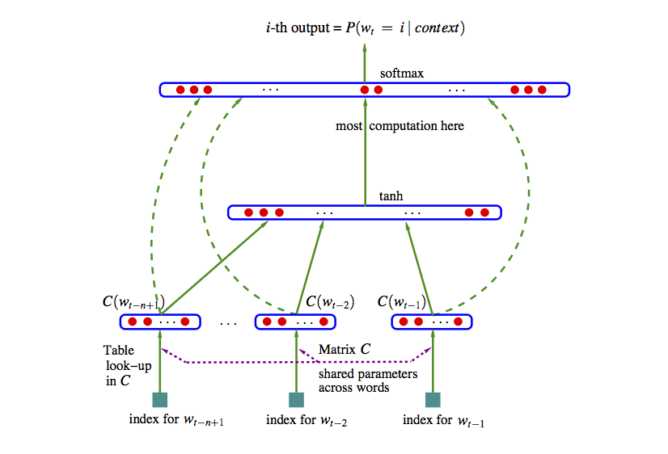
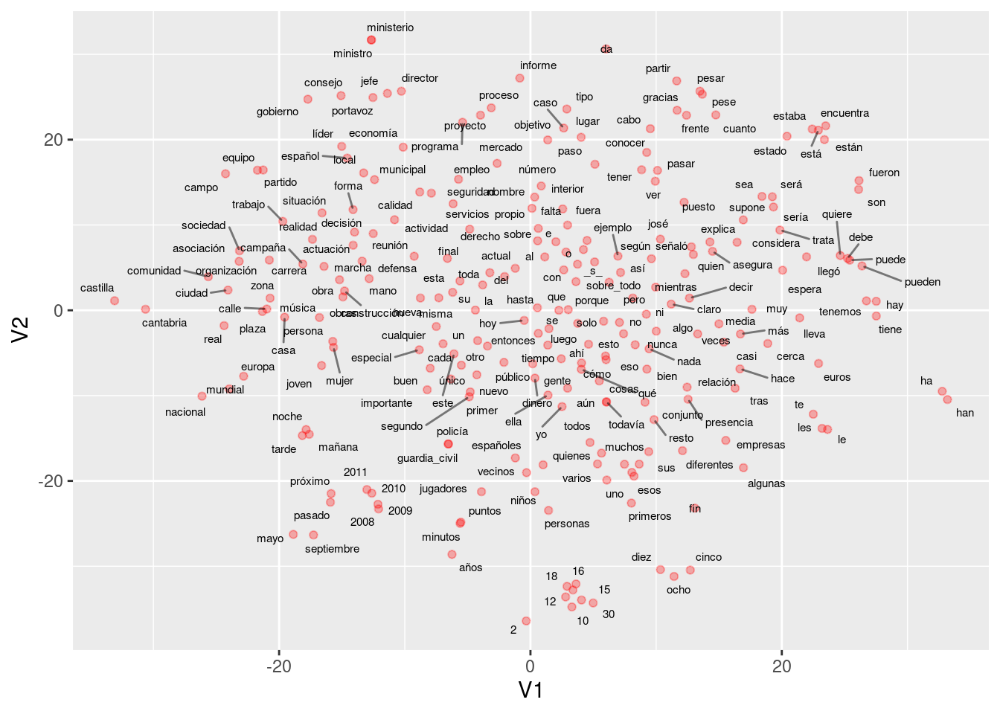

# Representación de palabras y word2vec

En esta parte empezamos a ver los enfoques más modernos (redes neuronales) para construir
modelos de lenguajes y resolver tareas de NLP. Se trata de modelos de lenguaje que incluyen más 
estructura, son más fáciles de regularizar y de ampliar si es necesario para incluir
dependencias de mayor distancia. El método de conteo/suavizamiento de ngramas es simple y funciona 
bien para algunas tareas, pero podemos construir mejores modelos con enfoques más estructurados, y con
más capacidad para aprender aspectos más complejos del lenguaje natural. 

Si $w=w_1w_2\cdots w_N$ es una frase, y las $w$ representan palabras, recordemos que un modelo de lenguaje con dependencia de $n$-gramas consiste de las probabilidades

$$P(w_t | w_{t-1} w_{t-2} \cdots w_{t-n+1}),$$

 (n=2, bigramas, n=3 trigramas, etc.)

Y vimos que tenemos problemas cuando observamos sucesiones que no vimos en el corpus de entrenamiento. Este problema se puede "parchar" utilizando técnicas de suavizamiento. Aún para colecciones de entrenamiento muy grandes tenemos que lidiar con este problema.

Podemos tomar un enfoque más estructurado pensando en representaciones "distribucionales" de palabras:

1. Asociamos a cada palabra en el vocabulario un vector numérico con $d$ dimensiones, que es su *representación distribuida*.
2. Expresamos la función de probabilidad como combinaciones de 
las representaciones vectoriales del primer paso.
3. Aprendemos (máxima verosimiltud posiblemente regularización) simultáneamente los vectores y la manera de combinar 
estos vectores para producir probabilidades.

 La idea de este modelo es entonces subsanar la relativa escasez de datos (comparado con todos los trigramas que pueden existir) con estructura. Sabemos que esta es una buena estrategia si la estrucutura impuesta es apropiada.

\BeginKnitrBlock{resumen}<div class="resumen">Una de las ideas fundamentales de este enfoque es representar
a cada palabra como un vector numérico de dimensión $d$. Esto
se llama una *representación vectorial distribuida*, o también
un *embedding de palabras*.</div>\EndKnitrBlock{resumen}

El objeto es entonces abstraer características de palabras (mediante estas representaciones) 
intentando no perder mucho de su sentido
original, lo que nos permite conocer palabras por su contexto, aún cuando no las hayamos observado antes.


#### Ejemplo {-}

¿Cómo puede funcionar este enfoque? Por ejemplo, si vemos la frase "El gato corre en el jardín", sabemos que una frase probable debe ser también "El perro corre en el jardín", pero quizá nunca vimos en el corpus la sucesión "El perro corre". La idea es que como "perro" y "gato" son funcionalmente similares (aparecen en contextos similares en otros tipos de oraciones como el perro come, el gato come, el perro duerme, este es mi gato, etc.), un modelo como el de arriba daría vectores similares a "perro" y "gato", pues aparecen en contextos similares. Entonces el modelo daría una probabilidad alta a "El perro corre en el jardín".

## Modelo de red neuronal

Podemos entonces construir una red neuronal con 2 capas ocultas como sigue (segimos [@bengio], una de
las primeras referencias en usar este enfoque). Usemos el ejemplo de trigramas:

1. **Capa de incrustación o embedding**. En la primera capa oculta, tenemos un mapeo de las entradas $w_1,\ldots, w_{n-1}$ a $x=C(w_1),\ldots, C(w_{n-1})$, donde $C$ es una función que mapea palabras a vectores de dimensión $d$. $C$ también se puede pensar como una matriz de dimensión $|V|$ por $d$. En la capa de entrada,

$$w_{n-2},w_{n-1} \to x = (C(w_{n-2}), C(w_{n-1})).$$


2. **Capa totalmente conexa**. En la siguiente capa oculta tenemos una matriz de pesos $H$ y la función logística (o tangente hiperbólica) $\sigma (z) = \frac{e^z}{1+e^z}$, como en una red neuronal usual. 

En esta capa calculamos
$$z = \sigma (a + Hx),$$
que resulta en un vector de tamaño $h$. 

3. La **capa de salida** debe ser un vector de probabilidades
sobre todo el vocabulario $|V|$. En esta capa tenemos pesos $U$ y hacemos
$$y = b + U\sigma (z),$$
y finalmente usamos softmax para tener probabilidades que suman uno:
$$p_i = \frac{\exp (y_i) }{\sum_j exp(y_j)}.$$

En el ajuste maximizamos la verosimilitud:

$$\sum_t \log \hat{P}(w_{t,n}|w_{t,n-2}w_{t-n-1}) $$ 


La representación en la referencia [@bengio] es:



Esta idea original ha sido explotada con éxito, aunque sigue siendo
intensivo en cómputo ajustar un modelo como este. Nótese que
el número de parámetros es del orden de $|V|(nm+h)$, donde $|V|$ es el tamaño del vocabulario (decenas o cientos de miles), $n$ es 3 o 4 (trigramas, 4-gramas), $m$ es el tamaño de la representacion (cientos) y $h$ es el número de nodos en la segunda capa (también cientos o miles).  Esto resulta en el mejor de los casos en modelos con miles de millones de parámetros. Adicionalmente, hay algunos cálculos costosos, como el softmax (donde hay que hacer una suma sobre el vocabulario completo). En el paper original se propone **descenso estocástico**.


### Ejemplo {-}
Veamos un ejemplo chico de cómo se vería el paso
feed-forward de esta red. Supondremos en este
ejemplo que los sesgos $a,b$ son
iguales a cero para simplificar los cálculos.

Consideremos que el texto de entrenamiento es
"El perro corre. El gato corre. El león corre. El león ruge."

En este caso, nuestro vocabulario consiste de los 8 tokens
$<s>$, el, perro, gato, león, corre, caza $</s>$. Consideremos un
modelo con $d=2$ (representaciones de palabras en 2 dimensiones),
y consideramos un modelo de trigramas.

Nuestra primera capa es una matriz $C$ de tamaño $2\times 8$,
es decir, un vector de tamaño 2 para cada palabra. Por ejemplo,
podríamos tener

```r
library(tidyverse)
set.seed(63)
C <- round(matrix(rnorm(16, 0, 0.1), 2, 8), 2)
colnames(C) <- c("_s_", "el", "perro", "gato", "león", "corre", "caza", "_ss_")
rownames(C) <- c("d_1", "d_2")
C
```

```
##       _s_    el perro gato  león corre caza  _ss_
## d_1  0.13  0.05  0.05 0.04 -0.17  0.04 0.03 -0.02
## d_2 -0.19 -0.19 -0.11 0.01  0.04 -0.01 0.02  0.02
```

En la siguiente capa consideremos que usaremos, arbitrariamente, $h=3$ unidades. Como estamos considerando bigramas, necesitamos una entrada de tamaño 4 (representación de un bigrama, que son dos vectores de la matriz $C$, para predecir la siguiente palabra).


```r
H <- round(matrix(rnorm(12, 0, 0.1), 3, 4), 2)
H
```

```
##       [,1]  [,2]  [,3]  [,4]
## [1,] -0.04  0.12 -0.09  0.18
## [2,]  0.09  0.10  0.06  0.08
## [3,]  0.10 -0.08 -0.07 -0.13
```

Y la última capa es la del vocabulario. Son entonces 8 unidades,
con 3 entradas cada una. La matriz de pesos es:


```r
U <- round(matrix(rnorm(24, 0, 0.1), 8, 3), 2)
rownames(U) <- c("_s_", "el", "perro", "gato", "león", "corre", "caza", "_ss_")
U
```

```
##        [,1]  [,2]  [,3]
## _s_    0.05 -0.15 -0.30
## el     0.01  0.16  0.15
## perro -0.14  0.10  0.05
## gato   0.04  0.09  0.12
## león   0.06 -0.03  0.02
## corre -0.01  0.00 -0.02
## caza   0.10  0.00  0.06
## _ss_   0.07 -0.10  0.01
```

Ahora consideremos cómo se calcula el objetivo con los
datos de entrenamiento. El primer trigrama es (\_s\_, el). La primera
capa entonces devuelve los dos vectores correspondientes a cada
palabra (concatenado):


```r
capa_1 <- c(C[, "_s_"], C[, "el"])
capa_1
```

```
##   d_1   d_2   d_1   d_2 
##  0.13 -0.19  0.05 -0.19
```

La siguiente capa es:


```r
sigma <- function(z){ 1 / (1 + exp(-z))}
capa_2 <- sigma(H %*% capa_1)
capa_2
```

```
##           [,1]
## [1,] 0.4833312
## [2,] 0.4951252
## [3,] 0.5123475
```

Y la capa final da


```r
y <- U %*% capa_2
y
```

```
##               [,1]
## _s_   -0.203806461
## el     0.160905460
## perro  0.007463525
## gato   0.125376210
## león   0.024393066
## corre -0.015080262
## caza   0.079073967
## _ss_  -0.010555858
```

Y aplicamos softmax para encontrar las probabilidades


```r
p <- exp(y)/sum(exp(y)) |> as.numeric()
p
```

```
##             [,1]
## _s_   0.09931122
## el    0.14301799
## perro 0.12267376
## gato  0.13802588
## león  0.12476825
## corre 0.11993917
## caza  0.13178067
## _ss_  0.12048306
```

Y la probabilidad es entonces


```r
p_1 <- p["perro", 1]
p_1
```

```
##     perro 
## 0.1226738
```

Cuya log probabilidad es


```r
log(p_1)
```

```
##     perro 
## -2.098227
```

Ahora seguimos con el siguiente trigrama, que
es "(perro, corre)". Necesitamos calcular la probabilidad
de corre dado el contexto "el perro". Repetimos nuestro cálculo:


```r
capa_1 <- c(C[, "el"], C[, "perro"])
capa_1
```

```
##   d_1   d_2   d_1   d_2 
##  0.05 -0.19  0.05 -0.11
```

```r
capa_2 <- sigma(H %*% capa_1)
capa_2
```

```
##           [,1]
## [1,] 0.4877275
## [2,] 0.4949252
## [3,] 0.5077494
```

```r
y <- U %*% capa_2
y
```

```
##               [,1]
## _s_   -0.202177217
## el     0.160227709
## perro  0.006598141
## gato   0.124982290
## león   0.024570880
## corre -0.015032262
## caza   0.079237709
## _ss_  -0.010274101
```

```r
p <- exp(y)/sum(exp(y)) |> as.numeric()
p
```

```
##             [,1]
## _s_   0.09947434
## el    0.14292280
## perro 0.12256912
## gato  0.13797317
## león  0.12479193
## corre 0.11994636
## caza  0.13180383
## _ss_  0.12051845
```

Y la probabilidad es entonces


```r
p_2 <- p["corre", 1]
log(p_2)
```

```
##     corre 
## -2.120711
```

Sumando, la log probabilidad es:


```r
log(p_1) + log(p_2)
```

```
##     perro 
## -4.218937
```

y continuamos con los siguientes trigramas del texto de entrenamiento.
Creamos una función


```r
feed_fow_p <- function(trigrama, C, H, U){
  trigrama <- strsplit(trigrama, " ", fixed = TRUE)[[1]]
  capa_1 <- c(C[, trigrama[1]], C[, trigrama[2]])
  capa_2 <- sigma(H %*% capa_1)
  y <- U %*% capa_2
  p <- exp(y)/sum(exp(y)) |> as.numeric()
  p
}

feed_fow_dev <- function(trigrama, C, H, U) {
  p <- feed_fow_p(trigrama, C, H, U)
  trigrama_s <- strsplit(trigrama, " ", fixed = TRUE)[[1]]
  log(p)[trigrama_s[3], 1]
}
```

Y ahora aplicamos a todos los textos:


```r
texto_entrena <- c("_s_ el perro corre _ss_", " _s_ el gato corre _ss_", " _s_ el león corre _ss_",
  "_s_ el león caza _ss_",  "_s_ el gato caza _ss_")
entrena_trigramas <- map(texto_entrena, 
  ~tokenizers::tokenize_ngrams(.x, n = 3)[[1]]) |> 
  flatten() |> unlist()
entrena_trigramas
```

```
##  [1] "_s_ el perro"     "el perro corre"   "perro corre _ss_" "_s_ el gato"     
##  [5] "el gato corre"    "gato corre _ss_"  "_s_ el león"      "el león corre"   
##  [9] "león corre _ss_"  "_s_ el león"      "el león caza"     "león caza _ss_"  
## [13] "_s_ el gato"      "el gato caza"     "gato caza _ss_"
```


```r
log_p <- sapply(entrena_trigramas, function(x) feed_fow_dev(x, C, H, U))
sum(log_p)
```

```
## [1] -31.21475
```

Ahora piensa como harías más grande esta verosimilitud. Observa
que "perro", "gato" y "león"" están comunmente seguidos de "corre".
Esto implica que nos convendría que hubiera cierta similitud
entre los vectores de estas tres palabras, por ejemplo:


```r
C_1 <- C
indices <- colnames(C) %in%  c("perro", "gato", "león")
C_1[1, indices] <- 3.0
C_1[1, !indices] <- -1.0
C_1
```

```
##       _s_    el perro gato león corre  caza  _ss_
## d_1 -1.00 -1.00  3.00 3.00 3.00 -1.00 -1.00 -1.00
## d_2 -0.19 -0.19 -0.11 0.01 0.04 -0.01  0.02  0.02
```

La siguiente capa queremos que extraiga el concepto "animal" en la palabra anterior, o algo
similar, así que podríamos poner en la unidad 1:


```r
H_1 <- H
H_1[1, ] <- c(0, 0, 5, 0)
H_1
```

```
##      [,1]  [,2]  [,3]  [,4]
## [1,] 0.00  0.00  5.00  0.00
## [2,] 0.09  0.10  0.06  0.08
## [3,] 0.10 -0.08 -0.07 -0.13
```

Nótese que la unidad 1 de la segunda capa se activa 
cuando la primera componente de la palabra anterior es alta.
En la última capa, podríamos entonces poner


```r
U_1 <- U
U_1["corre", ] <- c(4.0, -2, -2)
U_1["caza", ] <- c(4.2, -2, -2)
U_1
```

```
##        [,1]  [,2]  [,3]
## _s_    0.05 -0.15 -0.30
## el     0.01  0.16  0.15
## perro -0.14  0.10  0.05
## gato   0.04  0.09  0.12
## león   0.06 -0.03  0.02
## corre  4.00 -2.00 -2.00
## caza   4.20 -2.00 -2.00
## _ss_   0.07 -0.10  0.01
```

que captura cuando la primera unidad se activa. Ahora el cálculo
completo es:


```r
log_p <- sapply(entrena_trigramas, function(x) feed_fow_dev(x, C_1, H_1, U_1))
sum(log_p)
```

```
## [1] -23.53883
```

Y logramos aumentar la verosimilitud considerablemente. Compara las probabilidades:


```r
feed_fow_p("el perro", C, H, U)
```

```
##             [,1]
## _s_   0.09947434
## el    0.14292280
## perro 0.12256912
## gato  0.13797317
## león  0.12479193
## corre 0.11994636
## caza  0.13180383
## _ss_  0.12051845
```

```r
feed_fow_p("el perro", C_1, H_1, U_1)
```

```
##             [,1]
## _s_   0.03493901
## el    0.04780222
## perro 0.03821035
## gato  0.04690264
## león  0.04308502
## corre 0.33639351
## caza  0.41087194
## _ss_  0.04179531
```

```r
feed_fow_p("el gato", C, H, U)
```

```
##             [,1]
## _s_   0.09957218
## el    0.14289131
## perro 0.12246787
## gato  0.13795972
## león  0.12480659
## corre 0.11993921
## caza  0.13183822
## _ss_  0.12052489
```

```r
feed_fow_p("el gato", C_1, H_1, U_1)
```

```
##             [,1]
## _s_   0.03489252
## el    0.04769205
## perro 0.03813136
## gato  0.04679205
## león  0.04298749
## corre 0.33663831
## caza  0.41117094
## _ss_  0.04169529
```


**Observación**: a partir de este principio, es posible construir arquitecturas más 
refinadas que tomen en cuenta, por ejemplo,  relaciones más lejanas entre
partes de oraciones (no solo el contexto del n-grama), ver por ejemplo [el capítulo 10 del libro
de Deep Learning de Goodfellow, Bengio y Courville](https://www.deeplearningbook.org/contents/rnn.html).

Abajo exploramos una parte fundamental de estos modelos: representaciones de palabras, y modelos
relativamente simples para obtener estas representaciones.

## Representación de palabras

Un aspecto interesante de el modelo de arriba es que
nos da una representación vectorial de las palabras, en la forma
de los parámetros ajustados de la matriz $C$. Esta se puede entender
como una descripción numérica de cómo funciona una palabra en el contexto de su n-grama.

Por ejemplo, deberíamos encontrar que palabras como "perro" y "gato" tienen representaciones similares. La razón es que cuando aparecen,
las probabilidades sobre las palabras siguientes deberían ser similares, pues estas son dos palabras que se pueden usar en muchos contextos
compartidos.

También podríamos encontrar que palabras como perro, gato, águila, león, etc. tienen partes o entradas similares en sus vectores de representación, que es la parte que hace que funcionen como "animal mamífero" dentro de frases. 

Veremos que hay más razones por las que es interesante esta representación.


## Modelos de word2vec

Si lo que principalmente nos interesa es obtener la representación
vectorial de palabras, más recientemente se descubrió que es posible 
simplificar considerablemente el modelo de arriba para poder entrenarlo mucho más rápido, y obtener una representación que en muchas tareas se desempeña bien ([@word2vec]).

Hay dos ideas básicas que se pueden usar para reducir la complejidad del entrenamiento (ver más
en [@goodfellow] y [@word2vec]:

- Eliminar la segunda capa oculta: modelo de *bag-of-words* continuo y modelo de *skip-gram*.
- Cambiar la función objetivo (minimizar devianza/maximizar verosimilitud) por una más simple, mediante un truco que se llama *negative sampling*.

Como ya no es de interés central predecir la siguiente palabra a partir
de las anteriores, en estos modelos **intentamos predecir la palabra
central a partir de las que están alrededor**. 

### Arquitectura continuous bag-of-words {-}

La entrada es igual que en el modelo completo. En primer lugar,
simplificamos la segunda capa oculta pondiendo en $z$ el promedio de
los vectores $C(w_{n-2}), C(w_{n-1})$.  La última capa la dejamos igual por el momento:


El modelo se llama bag-of-words porque todas las entradas de la primera capa oculta contribuyen de la misma manera en la salida, independientemente del orden. Aunque esto no suena como buena idea para construir un modelo de lenguaje, veremos que resulta en una representación adecuada para algunos problemas.

1. En la primera capa oculta, tenemos un mapeo de las entradas $w_1,\ldots, w_{n-1}$ a $x=C(w_1),\ldots, C(w_{n-1})$, donde $C$ es una función que mapea palabras a vectores de dimensión $d$. $C$ también se puede pensar como una matriz de dimensión $|V|$ por $d$. En la capa de entrada,

$$w_{n-2},w_{n-1} \to x = (C(w_{n-2}), C(w_{n-1})).$$


2. En la siguiente "capa" oculta simplemente sumamos las entradas de $x$. Aquí nótese que realmente no hay parámetros.

3. Finalmente, la capa de salida debe ser un vector de probabilidades
sobre todo el vocabulario $|V|$. En esta capa tenemos pesos $U$ y hacemos
$$y = b + U\sigma (z),$$
y finalmente usamos softmax para tener probabilidades que suman uno:
$$p_i = \frac{\exp (y_i) }{\sum_j exp(y_j)}.$$

En el ajuste maximizamos la verosimilitud sobre el corpus. Por ejemplo, para una frase, su log verosimilitud es:

$$\sum_t \log \hat{P}(w_{t,n}|w_{t,n+1} \cdots w_{t-n-1}) $$

### Arquitectura skip-grams {-}

Otro modelo simplificado, con más complejidad computacional pero
mejores resultados (ver [@word2vec]) que
el bag-of-words, es el modelo de skip-grams. En este caso, dada
cada palabra que encontramos, intentamos predecir un número
fijo de las palabras anteriores y palabras posteriores 
(el contexto es una vecindad de la palabra).


La función objetivo se defina ahora (simplificando) como suma sobre $t$:

$$-\sum_t \sum_{ -2\leq j \leq 2, j\neq 0} \log P(w_{t-j} | w_t)$$
(no tomamos en cuenta dónde aparece exactamente $w_{t-j}$ en relación a $w_t$, simplemente consideramos que está en su contexto),
donde

$$\log P(w_{t-j}|w_t) =  u_{t-j}^tC(w_t) - \log\sum_k \exp{u_{k}^tC(w_t)}$$

Todavía se propone una simplificación adicional que resulta ser efectiva:

### Muestreo negativo {-}

La siguiente simplificación consiste en cambiar la función objetivo. En word2vec puede usarse "muestreo negativo".

Para empezar, la función objetivo original (para contexto de una sola palabra) es


$$E = -\log \hat{P}(w_{a}|w_{n}) = -y_{w_a} + \log\sum_j \exp(y_j),$$

donde las $y_i$ son las salidas de la penúltima capa. La dificultad está en el segundo término, que es sobre todo el vocabulario en incluye todos los parámetros del modelo (hay que calcular las parciales de $y_j$'s
sobre cada una de las palabras del vocabulario).


La idea del muestreo negativo es que si $w_a$ 
está en el contexto de $w_{n}$, tomamos una muestra de $k$ palabras
$v_1,\ldots v_k$ al azar
(2-50, dependiendo del tamaño de la colección), y creamos $k$
"contextos falsos" $v_j w_{n}$, $j=1\ldots,k$. Minimizamos
en lugar de la observación de arriba

$$E = -\log\sigma(y_{w_a}) + \sum_{j=1}^k \log\sigma(y_j),$$
en donde queremos maximizar la probabilidad de que ocurra
$w_a$ vs. la probabilidad de que ocurra alguna de las $v_j$.
Es decir, solo buscamos optimizar parámetros para separar lo mejor
que podamos la observación de $k$ observaciones falsas, lo cual implica que tenemos que mover un número relativamente chico de
parámetros (en lugar de todos los parámetros de todas las palabras del vocabulario). 

Las palabras "falsas" se escogen según una probabilidad ajustada
de unigramas (se observó empíricamente mejor desempeño cuando escogemos cada palabra con probabilidad proporcional a $P(w)^{3/4}$, en lugar de $P(w)$, ver [@word2vec]).


### Ejemplo {-}


```r
if(!require(wordVectors)){
  devtools::install_github("bmschmidt/wordVectors")
}
```

```
## pillar     (1.6.4  -> 1.7.0) [CRAN]
## magrittr   (2.0.1  -> 2.0.3) [CRAN]
## fansi      (0.5.0  -> 1.0.3) [CRAN]
## withr      (2.4.3  -> 2.5.0) [CRAN]
## tidyselect (1.1.1  -> 1.1.2) [CRAN]
## vctrs      (0.3.8  -> 0.4.1) [CRAN]
## tzdb       (0.2.0  -> 0.3.0) [CRAN]
## tibble     (3.1.6  -> 3.1.7) [CRAN]
## rlang      (0.4.12 -> 1.0.2) [CRAN]
## glue       (1.6.0  -> 1.6.2) [CRAN]
## cli        (3.1.0  -> 3.3.0) [CRAN]
## crayon     (1.4.2  -> 1.5.1) [CRAN]
## clipr      (0.7.1  -> 0.8.0) [CRAN]
## readr      (2.1.1  -> 2.1.2) [CRAN]
## * checking for file ‘/tmp/RtmpH4Bct7/remotes481028505762/bmschmidt-wordVectors-7f1914c/DESCRIPTION’ ... OK
## * preparing ‘wordVectors’:
## * checking DESCRIPTION meta-information ... OK
## * cleaning src
## * checking for LF line-endings in source and make files and shell scripts
## * checking for empty or unneeded directories
## * building ‘wordVectors_2.0.tar.gz’
```

```r
library(wordVectors)
```


```r
library(tidyverse)
ruta <- "../datos/noticias/ES_Newspapers.txt"
if(!file.exists(ruta)){
    periodico <- 
      read_lines(file= "https://es-noticias.s3.amazonaws.com/Es_Newspapers.txt",
                        progress = FALSE)
    write_lines(periodico, ruta)
} else {
    periodico <- read_lines(file= ruta,
                        progress = FALSE)
}
normalizar <- function(texto, vocab = NULL){
  # minúsculas
  texto <- tolower(texto)
  # varios ajustes
  texto <- gsub("\\s+", " ", texto)
  texto <- gsub("\\.[^0-9]", " _punto_ ", texto)
  texto <- gsub(" _s_ $", "", texto)
  texto <- gsub("\\.", " _punto_ ", texto)
  texto <- gsub("[«»¡!¿?-]", "", texto) 
  texto <- gsub(";", " _punto_coma_ ", texto) 
  texto <- gsub("\\:", " _dos_puntos_ ", texto) 
  texto <- gsub("\\,[^0-9]", " _coma_ ", texto)
  texto <- gsub("\\s+", " ", texto)
  texto
}
periodico_df <- tibble(txt = periodico) |>
                mutate(id = row_number()) |>
                mutate(txt = normalizar(txt))
```


Construimos un modelo con vectores de palabras de tamaño 100,
skip-grams de tamaño 4, y ajustamos con muestreo negativo
de tamaño 20:


```r
if(!file.exists('./salidas/noticias_w2v.txt')){
  tmp <- tempfile()
  # tokenización
  write_lines(periodico_df$txt,  tmp)
  prep <- prep_word2vec(tmp, 
          destination = './salidas/noticias_w2v.txt', bundle_ngrams = 2)
  } 
```

```
## Beginning tokenization to text file at ./salidas/noticias_w2v.txt
```

```
## Prepping /tmp/RtmpH4Bct7/file48103cb35a2
```

```
## Starting training using file ./salidas/noticias_w2v.txt
## Words processed: 100K     Vocab size: 73K  
Words processed: 200K     Vocab size: 124K  
Words processed: 300K     Vocab size: 168K  
Words processed: 400K     Vocab size: 209K  
Words processed: 500K     Vocab size: 247K  
Words processed: 600K     Vocab size: 281K  
Words processed: 700K     Vocab size: 314K  
Words processed: 800K     Vocab size: 346K  
Words processed: 900K     Vocab size: 376K  
Words processed: 1000K     Vocab size: 406K  
Words processed: 1100K     Vocab size: 434K  
Words processed: 1200K     Vocab size: 462K  
Words processed: 1300K     Vocab size: 489K  
Words processed: 1400K     Vocab size: 515K  
Words processed: 1500K     Vocab size: 540K  
Words processed: 1600K     Vocab size: 565K  
Words processed: 1700K     Vocab size: 590K  
Words processed: 1800K     Vocab size: 613K  
Words processed: 1900K     Vocab size: 637K  
Words processed: 2000K     Vocab size: 661K  
Words processed: 2100K     Vocab size: 684K  
Words processed: 2200K     Vocab size: 706K  
Words processed: 2300K     Vocab size: 729K  
Words processed: 2400K     Vocab size: 750K  
Words processed: 2500K     Vocab size: 771K  
Words processed: 2600K     Vocab size: 792K  
Words processed: 2700K     Vocab size: 813K  
Words processed: 2800K     Vocab size: 834K  
Words processed: 2900K     Vocab size: 854K  
Words processed: 3000K     Vocab size: 873K  
Words processed: 3100K     Vocab size: 893K  
Words processed: 3200K     Vocab size: 913K  
Words processed: 3300K     Vocab size: 932K  
Words processed: 3400K     Vocab size: 951K  
Words processed: 3500K     Vocab size: 970K  
Words processed: 3600K     Vocab size: 989K  
Words processed: 3700K     Vocab size: 1007K  
Words processed: 3800K     Vocab size: 1026K  
Words processed: 3900K     Vocab size: 1044K  
Words processed: 4000K     Vocab size: 1062K  
Words processed: 4100K     Vocab size: 1080K  
Words processed: 4200K     Vocab size: 1098K  
Words processed: 4300K     Vocab size: 1115K  
Words processed: 4400K     Vocab size: 1132K  
Words processed: 4500K     Vocab size: 1150K  
Words processed: 4600K     Vocab size: 1167K  
Words processed: 4700K     Vocab size: 1184K  
Words processed: 4800K     Vocab size: 1201K  
Words processed: 4900K     Vocab size: 1218K  
Words processed: 5000K     Vocab size: 1235K  
Words processed: 5100K     Vocab size: 1252K  
Words processed: 5200K     Vocab size: 1268K  
Words processed: 5300K     Vocab size: 1285K  
Words processed: 5400K     Vocab size: 1301K  
Words processed: 5500K     Vocab size: 1317K  
Words processed: 5600K     Vocab size: 1333K  
Words processed: 5700K     Vocab size: 1349K  
Words processed: 5800K     Vocab size: 1364K  
Words processed: 5900K     Vocab size: 1380K  
Words processed: 6000K     Vocab size: 1395K  
Words processed: 6100K     Vocab size: 1411K  
Words processed: 6200K     Vocab size: 1426K  
Words processed: 6300K     Vocab size: 1441K  
Words processed: 6400K     Vocab size: 1456K  
Words processed: 6500K     Vocab size: 1471K  
Words processed: 6600K     Vocab size: 1486K  
Words processed: 6700K     Vocab size: 1501K  
Words processed: 6800K     Vocab size: 1516K  
Words processed: 6900K     Vocab size: 1530K  
Words processed: 7000K     Vocab size: 1545K  
Words processed: 7100K     Vocab size: 1560K  
Words processed: 7200K     Vocab size: 1575K  
Words processed: 7300K     Vocab size: 1589K  
Words processed: 7400K     Vocab size: 1604K  
Words processed: 7500K     Vocab size: 1618K  
Words processed: 7600K     Vocab size: 1632K  
Words processed: 7700K     Vocab size: 1646K  
Words processed: 7800K     Vocab size: 1661K  
Words processed: 7900K     Vocab size: 1675K  
Words processed: 8000K     Vocab size: 1689K  
Words processed: 8100K     Vocab size: 1703K  
Words processed: 8200K     Vocab size: 1717K  
Words processed: 8300K     Vocab size: 1731K  
Words processed: 8400K     Vocab size: 1744K  
Words processed: 8500K     Vocab size: 1758K  
Words processed: 8600K     Vocab size: 1771K  
Words processed: 8700K     Vocab size: 1785K  
Words processed: 8800K     Vocab size: 1798K  
Words processed: 8900K     Vocab size: 1812K  
Words processed: 9000K     Vocab size: 1825K  
Words processed: 9100K     Vocab size: 1839K  
Words processed: 9200K     Vocab size: 1852K  
Words processed: 9300K     Vocab size: 1865K  
Words processed: 9400K     Vocab size: 1878K  
Words processed: 9500K     Vocab size: 1892K  
Words processed: 9600K     Vocab size: 1905K  
Words processed: 9700K     Vocab size: 1918K  
Words processed: 9800K     Vocab size: 1931K  
Words processed: 9900K     Vocab size: 1943K  
Words processed: 10000K     Vocab size: 1956K  
Words processed: 10100K     Vocab size: 1969K  
Words processed: 10200K     Vocab size: 1982K  
Words processed: 10300K     Vocab size: 1995K  
Words processed: 10400K     Vocab size: 2008K  
Words processed: 10500K     Vocab size: 2020K  
Words processed: 10600K     Vocab size: 2033K  
Words processed: 10700K     Vocab size: 2045K  
Words processed: 10800K     Vocab size: 2057K  
Words processed: 10900K     Vocab size: 2070K  
Words processed: 11000K     Vocab size: 2082K  
Words processed: 11100K     Vocab size: 2094K  
Words processed: 11200K     Vocab size: 2107K  
Words processed: 11300K     Vocab size: 2119K  
Words processed: 11400K     Vocab size: 2131K  
Words processed: 11500K     Vocab size: 2143K  
Words processed: 11600K     Vocab size: 2156K  
Words processed: 11700K     Vocab size: 2168K  
Words processed: 11800K     Vocab size: 2180K  
Words processed: 11900K     Vocab size: 2192K  
Words processed: 12000K     Vocab size: 2204K  
Words processed: 12100K     Vocab size: 2216K  
Words processed: 12200K     Vocab size: 2227K  
Words processed: 12300K     Vocab size: 2239K  
Words processed: 12400K     Vocab size: 2251K  
Words processed: 12500K     Vocab size: 2263K  
Words processed: 12600K     Vocab size: 2274K  
Words processed: 12700K     Vocab size: 2286K  
Words processed: 12800K     Vocab size: 2298K  
Words processed: 12900K     Vocab size: 2310K  
Words processed: 13000K     Vocab size: 2321K  
Words processed: 13100K     Vocab size: 2333K  
Words processed: 13200K     Vocab size: 2344K  
Words processed: 13300K     Vocab size: 2355K  
Words processed: 13400K     Vocab size: 2367K  
Words processed: 13500K     Vocab size: 2378K  
Words processed: 13600K     Vocab size: 2390K  
Words processed: 13700K     Vocab size: 2401K  
Words processed: 13800K     Vocab size: 2412K  
Words processed: 13900K     Vocab size: 2424K  
Words processed: 14000K     Vocab size: 2435K  
Words processed: 14100K     Vocab size: 2446K  
Words processed: 14200K     Vocab size: 2457K  
Words processed: 14300K     Vocab size: 2469K  
Words processed: 14400K     Vocab size: 2479K  
Words processed: 14500K     Vocab size: 2490K  
Words processed: 14600K     Vocab size: 2502K  
Words processed: 14700K     Vocab size: 2513K  
Words processed: 14800K     Vocab size: 2524K  
Words processed: 14900K     Vocab size: 2535K  
Words processed: 15000K     Vocab size: 2546K  
Words processed: 15100K     Vocab size: 2557K  
Words processed: 15200K     Vocab size: 2568K  
Words processed: 15300K     Vocab size: 2579K  
Words processed: 15400K     Vocab size: 2590K  
Words processed: 15500K     Vocab size: 2600K  
Words processed: 15600K     Vocab size: 2611K  
Words processed: 15700K     Vocab size: 2622K  
Words processed: 15800K     Vocab size: 2633K  
Words processed: 15900K     Vocab size: 2644K  
Words processed: 16000K     Vocab size: 2654K  
Words processed: 16100K     Vocab size: 2665K  
Words processed: 16200K     Vocab size: 2676K  
Words processed: 16300K     Vocab size: 2687K  
Words processed: 16400K     Vocab size: 2697K  
Words processed: 16500K     Vocab size: 2708K  
Words processed: 16600K     Vocab size: 2719K  
Words processed: 16700K     Vocab size: 2729K  
Words processed: 16800K     Vocab size: 2739K  
Words processed: 16900K     Vocab size: 2750K  
Words processed: 17000K     Vocab size: 2760K  
Words processed: 17100K     Vocab size: 2771K  
Words processed: 17200K     Vocab size: 2781K  
Words processed: 17300K     Vocab size: 2792K  
Words processed: 17400K     Vocab size: 2802K  
Words processed: 17500K     Vocab size: 2813K  
Words processed: 17600K     Vocab size: 2823K  
Words processed: 17700K     Vocab size: 2833K  
Words processed: 17800K     Vocab size: 2844K  
Words processed: 17900K     Vocab size: 2854K  
Words processed: 18000K     Vocab size: 2864K  
Words processed: 18100K     Vocab size: 2875K  
Words processed: 18200K     Vocab size: 2885K  
Words processed: 18300K     Vocab size: 2896K  
Words processed: 18400K     Vocab size: 2906K  
Words processed: 18500K     Vocab size: 2916K  
Words processed: 18600K     Vocab size: 2926K  
Words processed: 18700K     Vocab size: 2936K  
Words processed: 18800K     Vocab size: 2946K  
Words processed: 18900K     Vocab size: 2956K  
Words processed: 19000K     Vocab size: 2966K  
Words processed: 19100K     Vocab size: 2975K  
Words processed: 19200K     Vocab size: 2986K  
Words processed: 19300K     Vocab size: 2995K  
Words processed: 19400K     Vocab size: 3005K  
Words processed: 19500K     Vocab size: 3015K  
Words processed: 19600K     Vocab size: 3025K  
Words processed: 19700K     Vocab size: 3035K  
Words processed: 19800K     Vocab size: 3045K  
Words processed: 19900K     Vocab size: 3055K  
Words processed: 20000K     Vocab size: 3065K  
Words processed: 20100K     Vocab size: 3075K  
Words processed: 20200K     Vocab size: 3085K  
Words processed: 20300K     Vocab size: 3095K  
Words processed: 20400K     Vocab size: 3104K  
Words processed: 20500K     Vocab size: 3114K  
Words processed: 20600K     Vocab size: 3124K  
Words processed: 20700K     Vocab size: 3133K  
Words processed: 20800K     Vocab size: 3143K  
Words processed: 20900K     Vocab size: 3153K  
Words processed: 21000K     Vocab size: 3162K  
## Vocab size (unigrams + bigrams): 1814048
## Words in train file: 21011278
## Words written: 100K
Words written: 200K
Words written: 300K
Words written: 400K
Words written: 500K
Words written: 600K
Words written: 700K
Words written: 800K
Words written: 900K
Words written: 1000K
Words written: 1100K
Words written: 1200K
Words written: 1300K
Words written: 1400K
Words written: 1500K
Words written: 1600K
Words written: 1700K
Words written: 1800K
Words written: 1900K
Words written: 2000K
Words written: 2100K
Words written: 2200K
Words written: 2300K
Words written: 2400K
Words written: 2500K
Words written: 2600K
Words written: 2700K
Words written: 2800K
Words written: 2900K
Words written: 3000K
Words written: 3100K
Words written: 3200K
Words written: 3300K
Words written: 3400K
Words written: 3500K
Words written: 3600K
Words written: 3700K
Words written: 3800K
Words written: 3900K
Words written: 4000K
Words written: 4100K
Words written: 4200K
Words written: 4300K
Words written: 4400K
Words written: 4500K
Words written: 4600K
Words written: 4700K
Words written: 4800K
Words written: 4900K
Words written: 5000K
Words written: 5100K
Words written: 5200K
Words written: 5300K
Words written: 5400K
Words written: 5500K
Words written: 5600K
Words written: 5700K
Words written: 5800K
Words written: 5900K
Words written: 6000K
Words written: 6100K
Words written: 6200K
Words written: 6300K
Words written: 6400K
Words written: 6500K
Words written: 6600K
Words written: 6700K
Words written: 6800K
Words written: 6900K
Words written: 7000K
Words written: 7100K
Words written: 7200K
Words written: 7300K
Words written: 7400K
Words written: 7500K
Words written: 7600K
Words written: 7700K
Words written: 7800K
Words written: 7900K
Words written: 8000K
Words written: 8100K
Words written: 8200K
Words written: 8300K
Words written: 8400K
Words written: 8500K
Words written: 8600K
Words written: 8700K
Words written: 8800K
Words written: 8900K
Words written: 9000K
Words written: 9100K
Words written: 9200K
Words written: 9300K
Words written: 9400K
Words written: 9500K
Words written: 9600K
Words written: 9700K
Words written: 9800K
Words written: 9900K
Words written: 10000K
Words written: 10100K
Words written: 10200K
Words written: 10300K
Words written: 10400K
Words written: 10500K
Words written: 10600K
Words written: 10700K
Words written: 10800K
Words written: 10900K
Words written: 11000K
Words written: 11100K
Words written: 11200K
Words written: 11300K
Words written: 11400K
Words written: 11500K
Words written: 11600K
Words written: 11700K
Words written: 11800K
Words written: 11900K
Words written: 12000K
Words written: 12100K
Words written: 12200K
Words written: 12300K
Words written: 12400K
Words written: 12500K
Words written: 12600K
Words written: 12700K
Words written: 12800K
Words written: 12900K
Words written: 13000K
Words written: 13100K
Words written: 13200K
Words written: 13300K
Words written: 13400K
Words written: 13500K
Words written: 13600K
Words written: 13700K
Words written: 13800K
Words written: 13900K
Words written: 14000K
Words written: 14100K
Words written: 14200K
Words written: 14300K
Words written: 14400K
Words written: 14500K
Words written: 14600K
Words written: 14700K
Words written: 14800K
Words written: 14900K
Words written: 15000K
Words written: 15100K
Words written: 15200K
Words written: 15300K
Words written: 15400K
Words written: 15500K
Words written: 15600K
Words written: 15700K
Words written: 15800K
Words written: 15900K
Words written: 16000K
Words written: 16100K
Words written: 16200K
Words written: 16300K
Words written: 16400K
Words written: 16500K
Words written: 16600K
Words written: 16700K
Words written: 16800K
Words written: 16900K
Words written: 17000K
Words written: 17100K
Words written: 17200K
Words written: 17300K
Words written: 17400K
Words written: 17500K
Words written: 17600K
Words written: 17700K
Words written: 17800K
Words written: 17900K
Words written: 18000K
Words written: 18100K
Words written: 18200K
Words written: 18300K
Words written: 18400K
Words written: 18500K
Words written: 18600K
Words written: 18700K
Words written: 18800K
Words written: 18900K
Words written: 19000K
Words written: 19100K
Words written: 19200K
Words written: 19300K
Words written: 19400K
Words written: 19500K
Words written: 19600K
Words written: 19700K
Words written: 19800K
Words written: 19900K
Words written: 20000K
Words written: 20100K
Words written: 20200K
Words written: 20300K
Words written: 20400K
Words written: 20500K
Words written: 20600K
Words written: 20700K
Words written: 20800K
Words written: 20900K
Words written: 21000K
```


```r
if (!file.exists("./salidas/noticias_vectors.bin")) {
  modelo <- train_word2vec("./salidas/noticias_w2v.txt", 
          "./salidas/noticias_vectors.bin",
          vectors = 100, threads = 8, window = 4, cbow = 0,  
          iter = 20, negative_samples = 20, min_count = 10) 
} else {
  modelo <- read.vectors("./salidas/noticias_vectors.bin")
}
```

El resultado son los vectores aprendidos de las palabras, por ejemplo


```r
vector_gol <- modelo[["gol"]] |> as.numeric()
vector_gol
```

```
##   [1] -0.389627248  0.048135430  0.501164794 -0.035961468  0.291238993
##   [6]  0.642733335 -0.386596769  0.281559557 -0.199183896 -0.554564893
##  [11]  0.451201737  0.495587140 -0.525584400  0.166191801 -0.180947676
##  [16]  0.034590811  0.731496751  0.259901792 -0.201457486 -0.308042079
##  [21] -0.177875623 -0.220428273  0.408699900  0.001920983  0.011449666
##  [26] -0.718980432  0.153631359 -0.049470965  0.981541216  0.082757361
##  [31] -0.331263602  0.458369821 -0.429754555  0.128275126 -0.421742797
##  [36]  0.596242130 -0.093633644  0.066455603 -0.016802812 -0.301688135
##  [41]  0.079358041  0.446704596 -0.244078919 -0.137954682  0.695054173
##  [46]  0.335903019  0.216709450  0.604890466 -0.538004100 -0.291783333
##  [51] -0.579949379 -0.048889056  0.324184030 -0.055591993 -0.012452535
##  [56] -0.200338170  0.254620761  0.082836255  0.389545202 -0.185363784
##  [61] -0.021011911  0.307440221  0.415608138  0.248776823 -0.139897019
##  [66]  0.008641024  0.235776618  0.324411124 -0.171800703  0.131596789
##  [71] -0.163520932  0.370538741 -0.134094939 -0.193797469 -0.543500543
##  [76]  0.312639445 -0.172534481 -0.115350038 -0.293528855 -0.534602344
##  [81]  0.515545666  0.708557248  0.444676250 -0.054800753  0.388787180
##  [86]  0.483029991  0.281573176  0.434132993  0.441057146 -0.347387016
##  [91] -0.174339339  0.060069371 -0.034651209  0.407196820  0.661161661
##  [96]  0.261399239 -0.089392163 -0.043052837 -0.539683878  0.105241157
```

## Espacio de representación de palabras {#esprep}

Como discutimos arriba, palabras que se usan en contextos
similares por su significado o por su función (por ejemplo, "perro" y "gato"") deben tener representaciones similares, pues su contexto tiende a ser similar. **La similitud que usamos el similitud coseno**.

Podemos verificar con nuestro ejemplo:


```r
ejemplos <- modelo |>  closest_to("gol", n = 5)
ejemplos
```

```
##              word similarity to "gol"
## 1             gol           1.0000000
## 2          golazo           0.8252912
## 3     segundo_gol           0.7978025
## 4         penalti           0.7764458
## 5 potente_disparo           0.7755037
```
También podríamos calcular manualmente:

Que también podemos calcular como:


```r
vector_penalti <- modelo[["penalti"]] |> as.numeric()
cosineSimilarity(modelo[["gol"]], modelo[["penalti"]])
```

```
##           [,1]
## [1,] 0.7764458
```

O directamente:


```r
norma <- function(x) sqrt(sum(x^2))
sum(vector_gol * vector_penalti) / (norma(vector_gol) * norma(vector_penalti))
```

```
## [1] 0.7764458
```


### Geometría en el espacio de representaciones {-}

Ahora consideremos cómo se distribuyen las palabras en este
espacio, y si existe estructura geométrica en este espacio que tenga
información acerca del lenguaje.

Consideremos primero el caso de plurales de sustantivos.

- Como el contexto de los plurales es distinto de los singulares,
nuestro modelo debería poder capturar en los vectores su diferencia.
- Examinamos entonces cómo son geométricamente
diferentes las representaciones de plurales vs singulares
- Si encontramos un patrón reconocible, podemos utilizar este patrón, por ejemplo,
para encontrar la versión plural de una palabra singular, *sin usar ninguna
regla del lenguaje*.

Una de las relaciones geométricas más simples es la adición de vectores. Por ejemplo,
extraemos la diferencia entre gol y goles:


```r
ejemplos <- modelo |>  closest_to("dos", n = 15)
ejemplos
```

```
##       word similarity to "dos"
## 1      dos           1.0000000
## 2     tres           0.9666800
## 3   cuatro           0.9527403
## 4    cinco           0.9205234
## 5    siete           0.9024807
## 6     seis           0.8977667
## 7     ocho           0.8879153
## 8    nueve           0.8550580
## 9    trece           0.8514542
## 10 catorce           0.8321762
## 11    diez           0.8133345
## 12  quince           0.8102052
## 13    doce           0.8085939
## 14    once           0.8033385
## 15  veinte           0.7814970
```


```r
ejemplos <- modelo |>  closest_to(c("lluvioso"), n = 5)
ejemplos
```

```
##       word similarity to c("lluvioso")
## 1 lluvioso                   1.0000000
## 2 caluroso                   0.8041209
## 3   cálido                   0.6896448
## 4   húmedo                   0.6866749
## 5   gélido                   0.6660152
```


```r
ejemplos <- modelo |>  closest_to("presidente", n = 5)
ejemplos
```

```
##                   word similarity to "presidente"
## 1           presidente                  1.0000000
## 2       vicepresidente                  0.8412900
## 3        ex_presidente                  0.8321029
## 4 máximo_representante                  0.7781001
## 5     máximo_dirigente                  0.7629962
```


```r
ejemplos <- modelo |>  closest_to("parís", n = 5)
ejemplos
```

```
##         word similarity to "parís"
## 1      parís             1.0000000
## 2    londres             0.9232452
## 3 nueva_york             0.8464673
## 4       roma             0.8443222
## 5     berlín             0.8081766
```

Y vemos, por ejemplo, que el modelo puede capturar conceptos relacionados
con el estado del clima, capitales de países y números - aún cuando no hemos
anotado estas funciones en el corpus original. Estos vectores son similares
porque tienden a ocurrir en contextos similares.

### Geometría en el espacio de representaciones {-}

Ahora consideremos cómo se distribuyen las palabras en este
espacio, y si existe estructura geométrica en este espacio que tenga
información acerca del lenguaje.

Consideremos primero el caso de plurales de sustantivos.

- Como el contexto de los plurales es distinto de los singulares,
nuestro modelo debería poder capturar en los vectores su diferencia.
- Examinamos entonces cómo son geométricamente
diferentes las representaciones de plurales vs singulares
- Si encontramos un patrón reconocible, podemos utilizar este patrón, por ejemplo,
para encontrar la versión plural de una palabra singular, *sin usar ninguna
regla del lenguaje*.

Una de las relaciones geométricas más simples es la adición de vectores. Por ejemplo,
extraemos la diferencia entre gol y goles:


```r
plural_1 <- modelo[["goles"]] - modelo[["gol"]]
plural_1
```

```
## A VectorSpaceModel object of  1  words and  100  vectors
##            [,1]       [,2]        [,3]       [,4]        [,5]       [,6]
## [1,] -0.2301596 -0.2543171 -0.04071745 -0.2292878 0.004059255 -0.2283908
## attr(,".cache")
## <environment: 0x55e163dcd6b8>
```

que es un vector en el espacio de representación de palabras. Ahora sumamos este vector
a un sustantivo en singular, y vemos qué palabras están cercas de esta "palabra sintética":


```r
vector <-  modelo[["partido"]] + plural_1
modelo |> closest_to(vector, n = 5)
```

```
## Warning in if (class(formula) == "formula") {: the condition has length > 1 and
## only the first element will be used
```

```
## Warning in if (class(object) == "VectorSpaceModel") {: the condition has length
## > 1 and only the first element will be used
```

```
##                  word similarity to vector
## 1            partidos            0.7961097
## 2               goles            0.7589920
## 3 partidos_disputados            0.6937101
## 4  últimos_encuentros            0.6788752
## 5          encuentros            0.6697611
```

Nótese que la más cercana es justamente el plural correcto, o otros plurales con relación
al que buscábamos (como *encuentros*)

Otro ejemplo:


```r
plural_1 <- modelo[["días"]] - modelo[["día"]]
vector <-  modelo[["mes"]] + plural_1
modelo |>  closest_to(vector, n = 20) 
```

```
## Warning in if (class(formula) == "formula") {: the condition has length > 1 and
## only the first element will be used
```

```
## Warning in if (class(object) == "VectorSpaceModel") {: the condition has length
## > 1 and only the first element will be used
```

```
##                word similarity to vector
## 1        tres_meses            0.7858109
## 2              días            0.7708776
## 3             meses            0.7655628
## 4         diez_días            0.7199002
## 5        seis_meses            0.7110105
## 6       quince_días            0.7092209
## 7       nueve_meses            0.6903626
## 8        doce_meses            0.6887811
## 9               mes            0.6785786
## 10         18_meses            0.6483637
## 11         48_horas            0.6392776
## 12        diez_años            0.6365554
## 13             años            0.6339559
## 14          semanas            0.6284049
## 15      quince_años            0.6281021
## 16      dos_semanas            0.6147185
## 17       trimestres            0.6012591
## 18     días_hábiles            0.5972889
## 19 veinticinco_años            0.5955164
## 20     nueves_meses            0.5947687
```


Veremos ahora cómo funciona para el género de sustantivos:


```r
fem_1 <- modelo[["presidenta"]] - modelo[["presidente"]]
vector <-  modelo[["rey"]] + fem_1
modelo |>  closest_to(vector, n = 5) %>% filter(word != "rey")
```

```
## Warning in if (class(formula) == "formula") {: the condition has length > 1 and
## only the first element will be used
```

```
## Warning in if (class(object) == "VectorSpaceModel") {: the condition has length
## > 1 and only the first element will be used
```

```
##       word similarity to vector
## 1    reina            0.7402226
## 2 princesa            0.6662326
## 3      pía            0.6249812
## 4    perla            0.6189366
```

```r
vector <-  modelo[["tío"]] + fem_1
modelo |>  closest_to(vector, n = 5) %>% filter(word != "tío")
```

```
## Warning in if (class(formula) == "formula") {: the condition has length > 1 and
## only the first element will be used
```

```
## Warning in if (class(object) == "VectorSpaceModel") {: the condition has length
## > 1 and only the first element will be used
```

```
##      word similarity to vector
## 1   dueña            0.7036596
## 2 hermana            0.6947787
## 3  abuela            0.6871846
## 4     tía            0.6850960
```

### Evaluación de calidad de modelos {-}

La evaluación de estas aplicaciones puede hacerse por ejemplo, con tareas de analogía,
con listas de singular/plurales, de adjetivos/adverbios, masculino/femenino, etc (ver [@word2vec]),
(ver por ejemplo https://github.com/tmikolov/word2vec/blob/master/questions-words.txt). Adicionalmente,
si se utilizan en alguna tarea *downstream*, pueden evaluarse en el desempeño de esa
tarea particular.


**Ejercicio**: ¿cómo usarías esta geometría para encontrar el país en el que está una capital dada?

**Observación**: falta afinar los parámetros en este modelo.
Puedes probar cambiando negative sampling (por ejemplo, incrementa a 40), el número de vectores (50-200, por ejemplo), e incrementando *window* y el número de iteraciones.

Considera también un modelo preentrenado mucho más grande como [este](https://github.com/uchile-nlp/spanish-word-embeddings). Puedes bajar los vectores de palabras
y repetir las tareas mostradas (el formato bin es estándar para la implementación que usamos de word2vec).

---

Podemos visualizar el espacio de representaciones reduciendo dimensionalidad. En este caso, utilizamos *tsne*:


```r
library(tsne)
library(ggplot2)
library(ggrepel)
mat_vs <- modelo@.Data
# solo calculamos para las 500 palabras más comunes
num_palabras <- 500 
set.seed(1203)
vs_2 <- tsne(mat_vs[1:num_palabras, ], 
             max_iter = 1000, perplexity = 50)
```

```
## Warning in if (class(X) == "dist") {: the condition has length > 1 and only the
## first element will be used
```

```
## sigma summary: Min. : 0.50676082427291 |1st Qu. : 0.659095357760454 |Median : 0.736635035661307 |Mean : 0.75791167716744 |3rd Qu. : 0.841790649429495 |Max. : 1.11657529954154 |
```

```
## Epoch: Iteration #100 error is: 19.2455766810395
```

```
## Epoch: Iteration #200 error is: 0.84088184930299
```

```
## Epoch: Iteration #300 error is: 0.808986014121995
```

```
## Epoch: Iteration #400 error is: 0.798502126441899
```

```
## Epoch: Iteration #500 error is: 0.79708951735216
```

```
## Epoch: Iteration #600 error is: 0.796517693130686
```

```
## Epoch: Iteration #700 error is: 0.796283474583645
```

```
## Epoch: Iteration #800 error is: 0.796006303282691
```

```
## Epoch: Iteration #900 error is: 0.795958873280288
```

```
## Epoch: Iteration #1000 error is: 0.795805321392407
```


```r
set.seed(823)
colnames(vs_2) <- c("V1", "V2")
df_vs <- as_tibble(vs_2, .name_repair = "check_unique") %>%
  mutate(palabra = rownames(mat_vs[1:num_palabras, ]))
ggplot(df_vs %>% sample_n(250), 
  aes(x = V1, y = V2, label = palabra)) +
  geom_point(colour = 'red', alpha = 0.3) +
  geom_text_repel(size = 2, force = 0.3, segment.alpha = 0.5) 
```

```
## Warning: ggrepel: 15 unlabeled data points (too many overlaps). Consider
## increasing max.overlaps
```



## Usos de representaciones distribuidas

La idea general de construir representaciones densas de las palabras
(en lugar de representaciones ralas, como codificación dummy o one-hot encoding) es una fundamental en varias tareas de procesamiento de lenguaje natural. Se utiliza en clasificación de textos (*fast-text* es similar
al modelo bag-of-words),
respuesta de preguntas, traducción automática, recuperación
de información, reconocimiento de entidades, etc. Word2vec también puede ser
usado para sistemas de recomendación (las palabras son artículos, las canastas son los textos).

- Puedes ver la implementación original junto con aplicaciones [aquí](https://code.google.com/archive/p/word2vec/), y [aquí](https://github.com/tmikolov/word2vec).
- Un método similar es [Glove](https://nlp.stanford.edu/projects/glove/).

